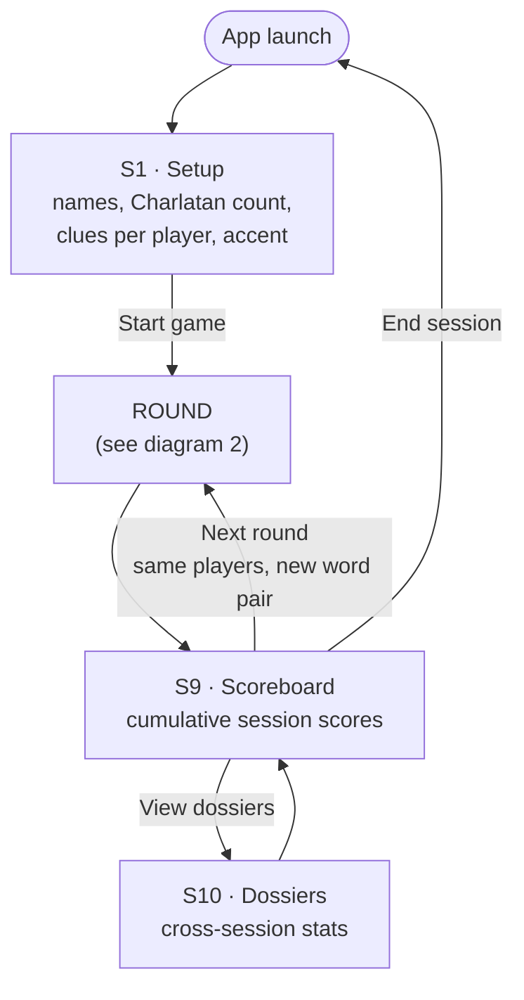
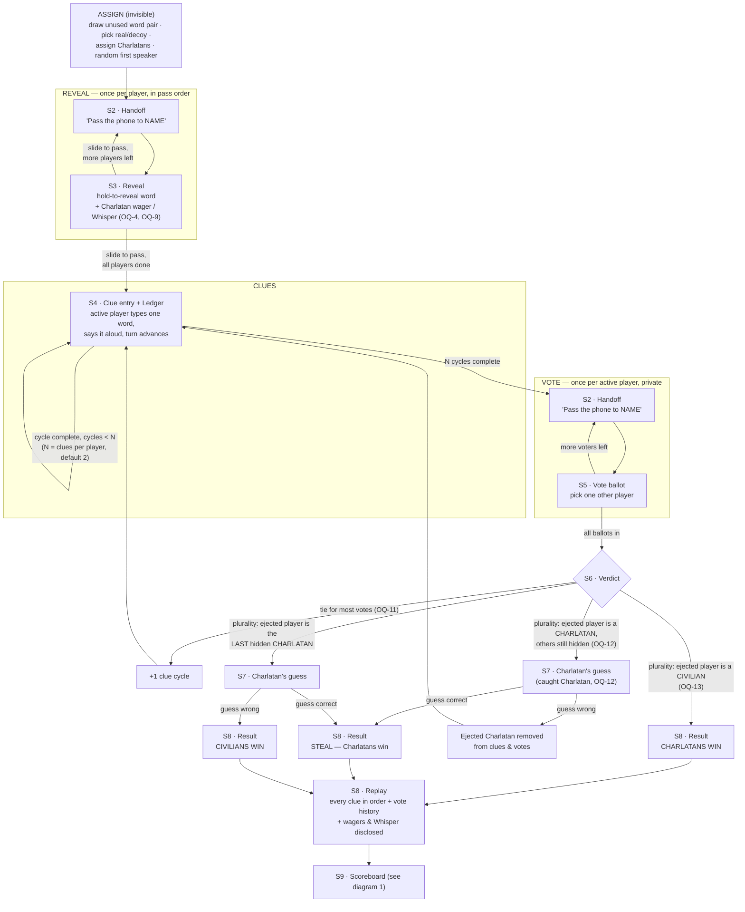
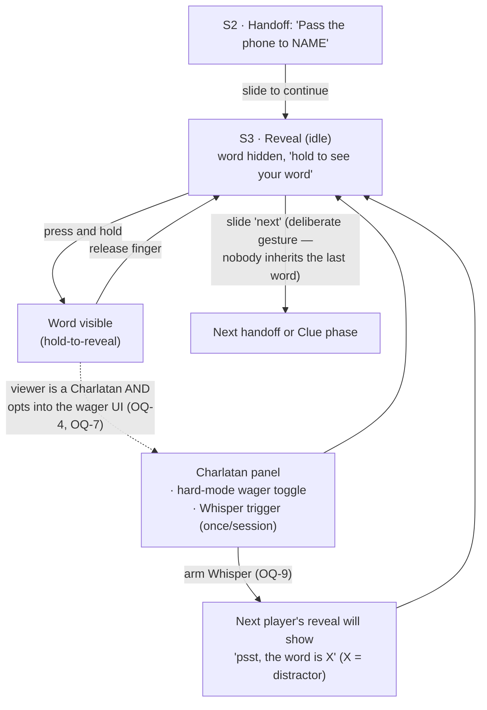
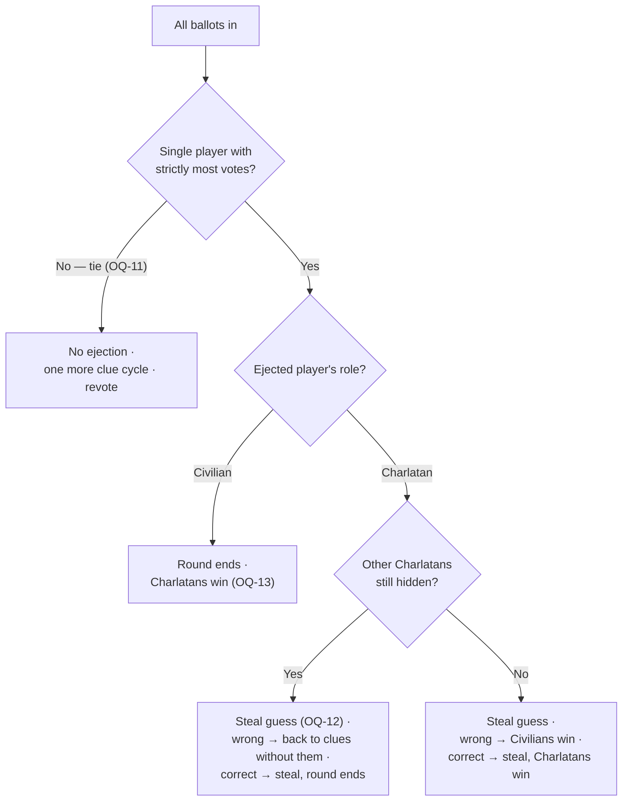

# Charlatan — Flow Diagrams & Screen Components

Diagrams are Mermaid and render directly on GitHub. Screen identifiers (S1–S10) match
[01-requirements.md §5](./01-requirements.md#5-screens). `OQ-n` markers reference
[03-open-questions.md](./03-open-questions.md).

---

## 1. Session-level flow

One session = repeated rounds with a cumulative scoreboard. There is no built-in session end
condition (OQ-19) — the group simply stops.

---

## 2. Round-level flow (the phase state machine)

---

## 3. Reveal micro-flow (the interaction that needs real care)

Invariants: the word renders **only** during an active pointer hold; leaving S3 always passes
through the slide gesture; the Charlatan panel must not be detectable by onlookers from
interaction shape or duration (OQ-7).

---

## 4. Vote resolution decision tree

---

## 5. Screen component inventory

### S1 · Setup
| Component | Notes |
|---|---|
| Title / logo lockup | Heavy display type, monochrome |
| Player name list | Add / remove / reorder; order = seating & pass order; min 4, max 12 (OQ-1) |
| Name input + add button | 56 px targets; duplicate names rejected (OQ-16) |
| Charlatan count stepper | Auto default (1 for 4–7, 2 for 8+), host override (OQ-2) |
| Clues-per-player stepper | Default 2, range 1–4 (OQ-3) |
| Accent color toggle | On by default |
| Start button | Disabled until valid; primary action |
| Dossier entry link | Existing local stats reachable pre-game |

### S2 · Handoff interstitial (shared by reveal & vote)
| Component | Notes |
|---|---|
| "Pass the phone to" label | Tiny uppercase, wide letter-spacing |
| Player name | Massive heavy type |
| Slide-to-continue control | Deliberate gesture; blocks accidental exposure |
| Progress indicator | "Player 3 of 8" |

### S3 · Reveal
| Component | Notes |
|---|---|
| Hold-to-reveal surface | Full-bleed; word only while pointer held; subtle scale animation on the word |
| Secret word / hard-mode notice | Massive heavy type; identical layout for civilian & Charlatan (OQ-4) |
| Whisper banner (conditional) | "psst, the word is X" when a Whisper targets this player (OQ-9) |
| Charlatan panel (conditional, disguised) | Hard-mode wager toggle + Whisper trigger (OQ-7) |
| Slide-to-pass control | Exits to next handoff / clue phase |

### S4 · Clue entry + Ledger
| Component | Notes |
|---|---|
| Turn banner | "NAME, your clue" — speaking order from random first speaker |
| Speaking-order strip | All players; ejected players struck through |
| One-word clue input | Single token enforced; submit ≥ 56 px |
| Ledger | Every clue this round, in order, always visible; grouped by cycle |
| Cycle counter | "Clue round 1 of 2" |
| Go-to-vote button | Appears only when N cycles complete |

### S5 · Vote ballot
| Component | Notes |
|---|---|
| Voter banner | "NAME, who is the Charlatan?" |
| Candidate list | All active players except the voter (OQ-10); 56 px rows |
| Ledger (read-only, collapsed) | Reference while voting |
| Confirm vote button | Locks ballot; no un-vote after confirm |

### S6 · Verdict
| Component | Notes |
|---|---|
| Vote tally | Aggregate only — individual ballots stay secret |
| Outcome banner | "Tie — one more clue each" / "NAME is voted out" |
| Continue button | To clues, guess, or result per decision tree |

### S7 · Charlatan's guess
| Component | Notes |
|---|---|
| Caught-Charlatan banner | "NAME — you were caught. One guess." |
| Guess input | Typed; case-insensitive match (OQ-14) |
| Submit button | One attempt only |

### S8 · Round result + replay
| Component | Notes |
|---|---|
| Role reveal | The **one accent-color moment** of the app; Charlatan names in the accent |
| Word pair reveal | Real word vs decoy word |
| Wager & Whisper disclosure | Hard-mode bets and Whisper usage revealed here only |
| Steal outcome | If a guess happened |
| Replay timeline | Every clue in order + where suspicion turned; the shareable moment |
| Points summary | Per-player deltas this round (OQ-15) |
| Continue button | To scoreboard |

### S9 · Scoreboard
| Component | Notes |
|---|---|
| Cumulative score table | All rounds this session; shown between every round |
| Round history strip | Compact per-round outcomes |
| Next-round button | Same players, new assignment |
| End-session button | Back to launch/setup |
| Dossiers link | To S10 |

### S10 · Dossiers
| Component | Notes |
|---|---|
| Per-player stat cards | "Survived 8 of 9 Charlatan rounds", wrong-vote streaks, steals, hard-mode record, Whispers |
| Storage notice | Local-only, this device |
| Reset control | Clears local stats, with confirm (OQ-16) |
