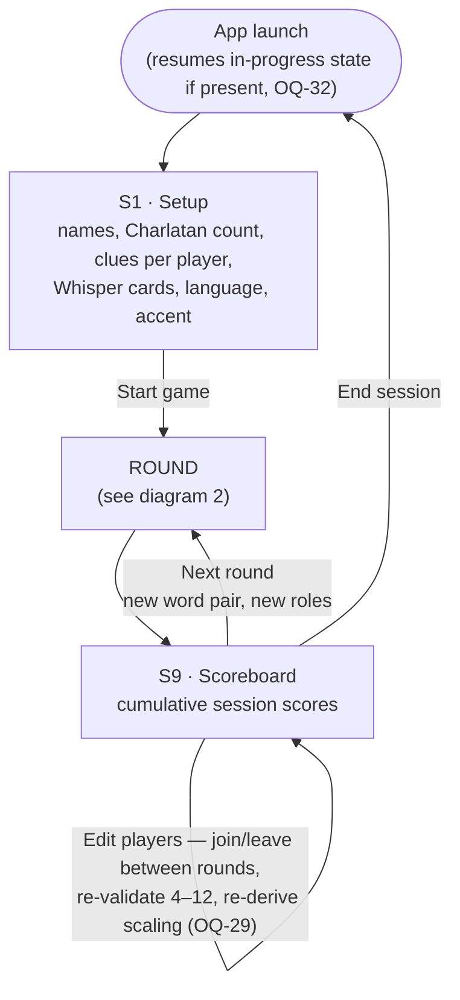
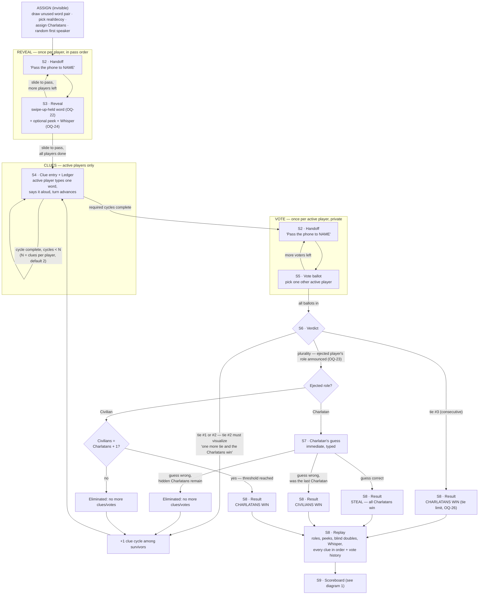
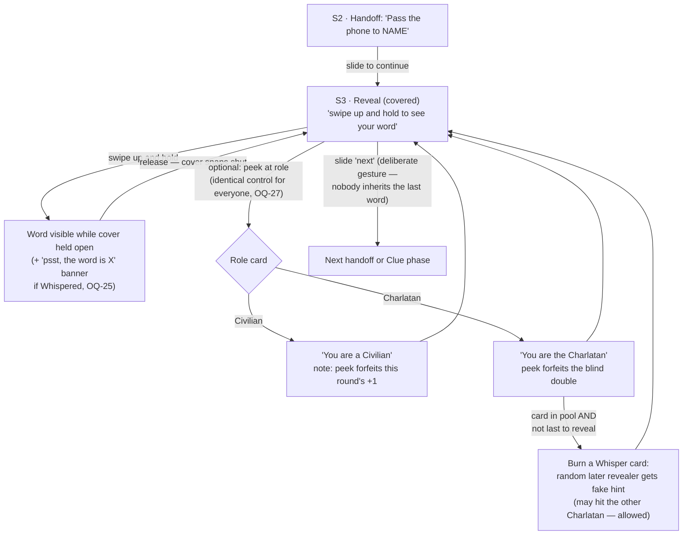
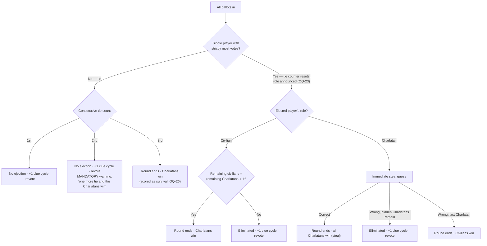

# Charlatan — Flow Diagrams & Screen Components

Diagrams are Mermaid and render directly on GitHub. Screen identifiers (S1–S9) match
[01-requirements.md §5](./01-requirements.md#5-screens). `OQ-n` markers reference the
second-pass register in [04-open-questions.md](./04-open-questions.md).

---

## 1. Session-level flow

One session = repeated rounds with a cumulative scoreboard. There is no session end
condition — the group simply stops. The roster may change between rounds.

---

## 2. Round-level flow (the phase state machine)

---

## 3. Reveal micro-flow (the interaction that needs real care)

Invariants: the word renders **only** while the cover is actively held open (OQ-22); leaving
S3 always passes through the slide gesture; peek/role-card interactions are identical in
shape and plausible duration for both roles (OQ-27); peeking is possible only on the player's
own reveal turn.

---

## 4. Vote resolution decision tree

---

## 5. Screen component inventory

### S1 · Setup
| Component | Notes |
|---|---|
| Title / logo lockup | Heavy display type, monochrome |
| Player name list | Add / remove / reorder; order = seating & pass order; min 4, max 12; unique non-empty names |
| Name input + add button | 56 px targets |
| Charlatan count stepper | Auto default (1 for 4–7, 2 for 8+), override clamped 1…⌊players/3⌋ |
| Clues-per-player stepper | Default 2, range 1–4 |
| Whisper cards stepper | Default 1; session-wide pool (OQ-24) |
| Language selector | Dutch / English (OQ-30) |
| Accent color toggle | On by default |
| Start button | Disabled until valid; primary action |

### S2 · Handoff interstitial (shared by reveal & vote)
| Component | Notes |
|---|---|
| "Pass the phone to" label | Tiny uppercase, wide letter-spacing |
| Player name | Massive heavy type |
| Slide-to-continue control | Deliberate gesture; blocks accidental exposure |
| Progress indicator | "Player 3 of 8" (active players only) |

### S3 · Reveal
| Component | Notes |
|---|---|
| Cover panel | Full-bleed; drag up to expose, snaps shut on release (OQ-22); Motion-driven physics |
| Secret word | Massive heavy type; identical layout for civilian & Charlatan |
| Whisper banner (conditional) | "psst, the word is X" when a Whisper targets this player (OQ-25) |
| Peek control | Identical for every player (OQ-27); opens role card |
| Role card (on peek) | Civilian: forfeits +1 reward · Charlatan: forfeits blind double, shows Whisper control when available |
| Whisper control (conditional) | Only for a peeked Charlatan with a card in the pool who is not last to reveal |
| Slide-to-pass control | Exits to next handoff / clue phase |

### S4 · Clue entry + Ledger
| Component | Notes |
|---|---|
| Turn banner | "NAME, your clue" — speaking order from random first speaker, re-randomized each round |
| Speaking-order strip | All players; eliminated players struck through and skipped |
| One-word clue input | Non-blocking warnings: multi-word, clue equals own secret word (OQ-31); submit ≥ 56 px |
| Ledger | Every clue this round, in order, always visible; grouped by cycle |
| Cycle counter | "Clue round 1 of 2" (+ extra cycles after ties/ejections) |
| Tie-stakes banner (conditional) | Persists through the cycle after the 2nd consecutive tie: "one more tie and the Charlatans win" |
| Go-to-vote button | Appears only when the required cycles are complete |

### S5 · Vote ballot
| Component | Notes |
|---|---|
| Voter banner | "NAME, who is the Charlatan?" |
| Candidate list | Active players except the voter; 56 px rows |
| Ledger (read-only, collapsed) | Reference while voting |
| Tie-stakes banner (conditional) | Visible during the ballot after the 2nd consecutive tie |
| Confirm vote button | Locks ballot; no un-vote after confirm |

### S6 · Verdict
| Component | Notes |
|---|---|
| Vote tally | Aggregate only — individual ballots stay secret |
| Outcome banner | "Tie — one more clue each" / "NAME is voted out — they were a Civilian/Charlatan" (OQ-23) |
| Tie counter visualization | Escalates: neutral on 1st tie; **mandatory prominent "one more tie and the Charlatans win" on the 2nd** |
| Continue button | To clues, guess, or result per decision tree |

### S7 · Charlatan's guess
| Component | Notes |
|---|---|
| Caught-Charlatan banner | "NAME — you were caught. One guess." |
| Guess input | Typed; case-insensitive, trimmed, singular/plural tolerance |
| Submit button | One attempt only |

### S8 · Round result + replay
| Component | Notes |
|---|---|
| Role reveal | The **one accent-color moment** of the app; Charlatan names in the accent |
| Word pair reveal | Real word vs decoy word |
| Peek & blind disclosure | Who peeked; blind doubles and civilian no-peek rewards earned (OQ-27, OQ-28) |
| Whisper disclosure | Who burned a card, on whom, and the fake word |
| Steal outcome | The typed guess, shown so the group can judge near-misses |
| Replay timeline | Every clue in order + where suspicion turned; the shareable moment |
| Points summary | Per-player deltas this round (OQ-26) |
| Continue button | To scoreboard |

### S9 · Scoreboard
| Component | Notes |
|---|---|
| Cumulative score table | All rounds this session; shown between every round |
| Round history strip | Compact per-round outcomes |
| Edit-players control | Join/leave between rounds; re-validates 4–12, re-derives Charlatan scaling (OQ-29) |
| Next-round button | New assignment with current roster |
| End-session button | Back to launch/setup |
